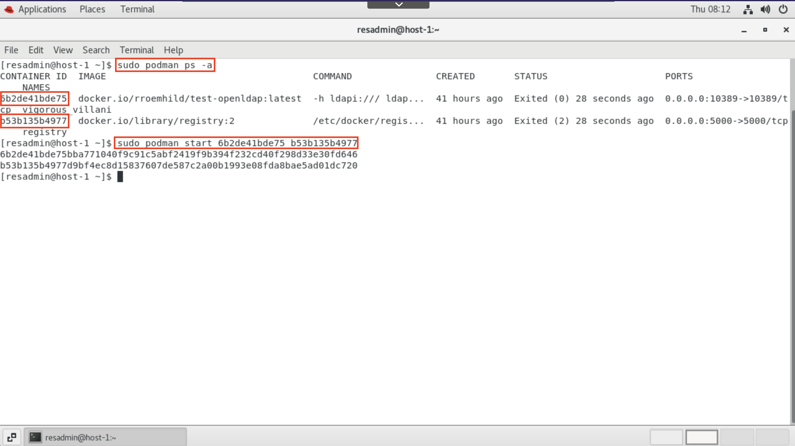
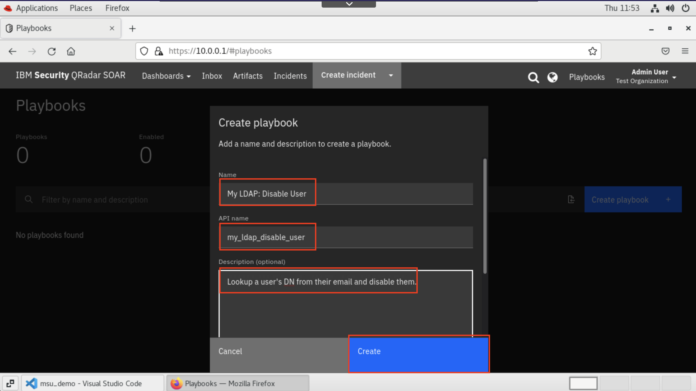

# IBM **Security** QRadar SOAR: Developing My First App


***Shane Curtin & Bo Bleckel, App Engineers, IBM **Security** QRadar SOAR***

---

<!-- TODO:TOC -->

---

## Step 0: *Sign up for SkyTap Account:*

<!-- TODO! -->
* Go to https://ibm.biz/xxx

* Sign in with email and password provided by course provider

---

## Step 1: *Login to Virtual Environment*

  

* Login as `resadmin` with the password shared by your course leader.

* Open **FireFox** and log into **IBM Security QRadar SOAR**.

* Restart the `ldap` and `registry` podman conatiners:
    
    List all podman processes:
    ```
    sudo podman ps -a
    ```

    From the output of the above command, start those containers:
    ```
    sudo podamn start <CONATINER_ID_1> <CONTAINER_ID_2>
    ```

    
    > More info on the LDAP container can be found [here](https://github.com/rroemhild/docker-test-openldap)

---

## Step 2: *VS Code IDE Setup*

* Open VS Code
    
* Create a new terminal
    
* Ensure that the python version is 3.6.x and that pip has `resilient-circuits` and `resilient-sdk` installed
    

    > *Note that you can use a later version of Python. As of publication of this lab, IBM Security QRadar SOAR officially supports 3.6 and 3.9 for app development.*
---

## Step 3: *`resilient-circuits` Configuration*

* In your terminal, run the following command to create a local `app.config` file:
    ```
    resilient-circuits config -c
    ```
    And open the file in your IDE by running 
    ```
    code ~/.resilient/app.config
    ```
    
* Switch to Firefox and nagvigate to your SOAR host, in this case, 10.0.0.1 or through the bookmark in the bookmark menu. Log in using the saved admin credentials.
    
* Navigate to the **API Keys** section of the **Users** tab in **Administrator Settings** and create a new API Key.
    
* Give the API Key the name "Local Integration Server" and give it all permissions. Click Create.
    
* IMPORTANT: Before clicking away from the screen that displays the crednetials, copy them to your clipboard. (If you accidentally navigate away from this screen that's ok. You can click into the key and simply regenerate the credentials.)
* Switch back to VS Code. Here we'll fill in the required values for our `app.config` file, including the copied API Key info, the Organization (in this case `Test Organization`) and the host information.
    
    Scroll down to find the `cafile` setting and set to `False`:
    

---

## Step 4: *Create Message Destination in SOAR*

* Switch back to the SOAR platform and navigate in the UI to the **Destinations** tab found within **Customization Settings**.
    
* Create a new **Message Destination** of type **Queue** with display name and API name `fn_my_ldap`. Add the API Key generated earlier to the list of allowed keys for this message destination. Click **Add**.
    

---

## Step 5: *Create Functions for `fn_my_ldap`*

* Navigate to the **Functions** tab found with **Customization Settings**. Create a new Function called `My LDAP: Search`:
    
* Create the input field `my_ldap_search_filter` and add it to the function:
    
    
* **Save & Close** the function.
* Repeat this process for a function called `My LDAP: Toggle Access` with inputs `my_ldap_user_dn` (Text, Required), `my_ldap_enable` (Boolean, Optional) and `my_ldap_disable` (Boolean, Optional):
    
* **Save & Close** the function.

---

## Step 6: *Create a custom Datatable*

* Navigate to the **Layouts** tab found with **Customization Settings**.
* Select **Incident Tabs** and scroll down and select any of the specific tabs. We chose **Artifacts** as that is where we'll place the custom datatable.
    
    
    Click **Add Table**.
* Name the table **My LDAP: Results** and give it an API name `my_ldap_dt`.
    
    Click **Next**.
* Create three columns: **Distinguished Name**, **User**, **Status**:
    
    Click **Next**. This will now walk you through each column's details.
* Fill in the following details for the "Distinguished Name" column:
    * Type: `Text`
    * Label: "Distinguished Name"
    * API Name: `my_ldap_dt_dn`
    
    Click **Next**.
* Fill in the following details for the "User" column:
    * Type: `Text`
    * Label: "User"
    * API Name: `my_ldap_dt_user`
    
    Click **Next**.
* Fill in the following details for the "Status" column:
    * Type: `Text Area`
    * Label: "Status"
    * API Name: `my_ldap_dt_status`
    * *Check* "Add rich Text controls"
    
    Click **Next**.
* Click **Create**.
* Click and drag the newly create table to the Artifacts tab section so it will display along side the rest of the Artifacts on an Incident.
    
    Click **Save**.

---

## Step 7: *Create the Function Package in Code*

* Switch back to VS Code. In the terminal, navigate to the directory where you want to create and save your app's package files.
* Run the `codegen` command and pull in your message destination, functions, and datatable.
    ```
    resilient-sdk codegen -p fn_my_ldap -m fn_my_ldap -d my_ldap_dt
    ```
    
    > Note: we did not need to specifically mention the functions, as they are included with the message destination that they are associated with.

    > Note: this did necessitate that we complete step 3 where the app.config values were filled in.

---

## Step 8: *Fill in the Code for the Function and Utility Files*

* Copy in the values from the linked files below into their corresponding files in your package:
    * [fn_my_ldap/components/funct_my_ldap_search.py](./python_assets/funct_my_ldap_search.py)
    * [fn_my_ldap/components/funct_my_ldap_toggle_user_access.py](./python_assets/funct_my_ldap_toggle_user_access.py)
    * [fn_my_ldap/util/config.py](./python_assets/config.py)
    * [fn_my_ldap/util/selftest.py](./python_assets/selftest.py)
    * [fn_my_ldap/setup.py](./python_assets/setup.py)
* Pip install the app in editable mode:
    ```
    cd fn_my_ldap
    pip install -e .
    ```
    
    > Note: this does *not* have to be done each time a change is made in the code as the package was installed in `editable` mode, however, it *does need* to be redone each time a change is made in the *setup.py* file; all other files' changes will be reflected automatically.
* Create a config section and populate it with data:
    ```
    resilient-circuits config -u
    ```
    Then open the app.config file in VS Code
    ```
    code ~/.resilient/app.config
    ```
    Fill in the following values for the `[fn_my_ldap]` section:
    ```
    [fn_my_ldap]
    server=10.0.0.1
    port=10389
    admin_user=cn=admin,dc=planetexpress,dc=com
    admin_password=GoodNewsEveryone
    search_base=ou=people,dc=planetexpress,dc=com
    ```

---

## Step 9: *Create a Playbook to Test*

* Switch back to SOAR. Navigate to the Playbooks interface of the platform:
    
* Click **Create Playbook**.
* Call it "My LDAP: Disable User":
    
* Click **Create**.
* Set the **Activation Type** to **Manual** and the **Object** to **Artifact** as we'll be manually running this on email artifacts.
    
* Create an activation condition so that this only activates on `Email Recipient` artifacts. This could be changed to suit your needs. For demo purposes, we'll stick with just the one condition.
    
    
    Click **Done**.
* Expand the Function panel on the left. Under **Other**, add both the functions we made previously to the canvas:
    
* Now we'll fill out the details for each function.
    * For the Search function, add the following input script:
        ```python
        inputs.my_ldap_search_filter = "(mail={})".format(artifact.value)
        ```
        
        Click **Save**.
    * Name the output of the Search function `search_output`.
    * For the Toggle function, add the following input script:
        ```python
        inputs.my_ldap_disable = True
        inputs.my_ldap_user_dn = playbook.functions.results.search_output.content.get("result_list")[0]
        ```
        
        Click **Save**.
    * Name the output of the Toggle function `toggle_output`.
* Now we need to build the flow of the playbook. There needs to be a decision point where based on the output of the first function, we run the second function. If there was no Distinguished Name found in the search function, we don't want to run the toggle function. To accomplish this we will add a Condition Point to the canvas (which can be found by expanding the Decision Points panel on the left).
    
* Click **Create Condition**. Name the condition "LDAP Search Success" and switch to the **Script Builder** condition option. Enter the following script as the condition:
    ```python
    if playbook.functions.results.search_output.success:
        result = True
    else:
        result = False
    ```
    
    Click **Done**.
    > Note: `result` must be defined for all branches of the condition to properly function.
* Now we must connect the paths of the playbook. To do that, click the vertex you wish to connect *from*, and drag from one of the blue dots to a blue dot on the vertex you wish to connect *to*. Repeat until it looks like this:
    
* Now we must deal with two things: how to end the playbook in our two branches that we've created.
* So we'll create two local scripts to handle the two possible options.
    
    * Local Script #1: **My LDAP: Toggle Success**
        ```python
        results = playbook.functions.results.toggle_output

        if results.success:
            row = incident.addRow("my_ldap_dt")

            row.my_ldap_dt_dn = results.inputs.get("my_ldap_user_dn")
            row.my_ldap_dt_user = artifact.value
            row.my_ldap_dt_status = '<div style="color:#e60000">'+results.content.get("status")+'</div>'
        ```
        
    * Local Script #2: **My LDAP: Search Failed**
        ```python
        incident.addNote("User <b>{}</b> not found in LDAP".format(artifact.value))
        ```
        
* Add the two scripts to the canvas and attach to the rest of the playbook as shown:
    
* Finally, add an endpoint (found in the decision points panel) and connect the two scripts to it.
* Click **Save** and **Enable Playbook**.
    

---

## Step 10: *Start `resilient-circuits` Server*

* Switch back to VS Code and the terminal. In the terminal, we'll want to run `codegen` to reload and bring in the playbook (find the API Name in the info section of the Playbook) and any other changes we made in the UI.
    ```
    resilient-sdk codegen -p . --reload -pb my_ldap_disable_user
    ```
    
    > Note: you should be generous in running `codegen --reload` as much as you want. It will never hurt, and it can be painful if you forget to reload any UI changes you've made.

* Now we'll start our `resilient-circuits` server to allow the SOAR platform to pick up our code for the functions that we've written:
    ```
    resilient-circuits run
    ```
    
    Keep any eye out for *"resilient-circuits has started successfully and is now running..."*
    
    > Note: this will only work properly if you already used `pip` to install the app as at the end of step 8.

---

## Step 11: *Test*

* Return to the UI and exit out of the playbook. Create a new incident with default values and add an Email Recipient artifact to the incident with value `hubert@planetexpress.com`.
    
* Select the action **My LDAP: Disable User** from the list of available actions for the artifact.
    
* This will kick off the playbook and two functions. If you switch back to VS Code, you should see the activity in the logs in `resilient-circuits`:
    
* Refresh the artifacts tab, and you should see the following in the datatable:
    

---

## Step 12: *Debug `resilient-circuits` server*

TODO

---

## Step 13: *Package*

TODO

---

## Step 14: *Push to local registry*

TODO

---

## Step 15: *Install with App Host*

TODO

---


1. Stop `circuits` and setup debug configuration
1. Start `circuits` using the debug config, and set a breakpoint in `funct_my_ldap_search.py`

1. Once that's all done, we want to do a final `codegen --reload` then we can run `resilient-sdk package -p . --no-samples --respository-name my_msu_repo`

    TODO [Details on the repo name and no samples...]

1. Then we can do a 
    ```
    sudo podman build . -t localhost:5000/my_msu_repo/fn_my_ldap:1.0.0
    ```

    This will build the docker container image, with a tag that points to our local repository which we can then push to:
    ```
    sudo podman push localhost:5000/my_msu_repo/fn_my_ldap:1.0.0
    ```

1. Now we use the file located in `fn_my_ldap/dist/app-fn_my_ldap-1.0.0.zip` and upload through the UI. Configure the app and save the changes. 